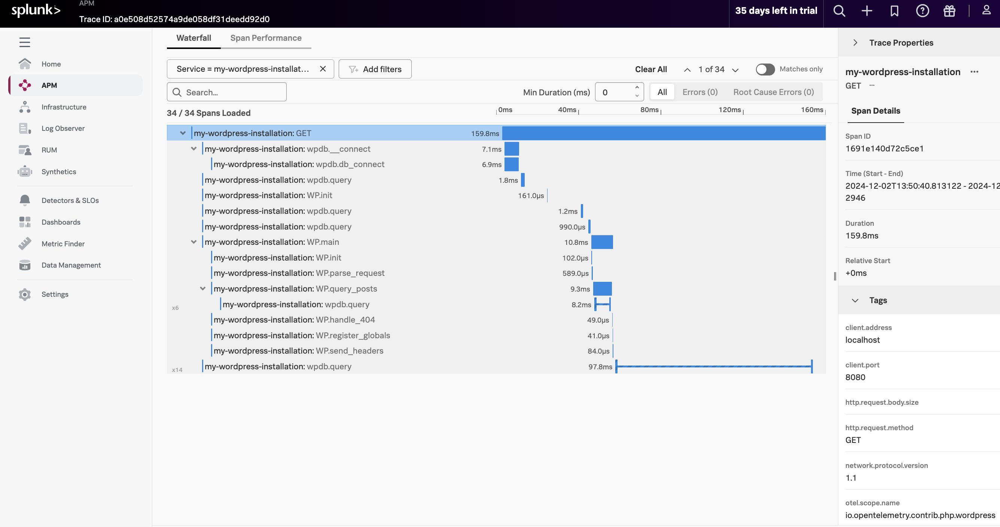
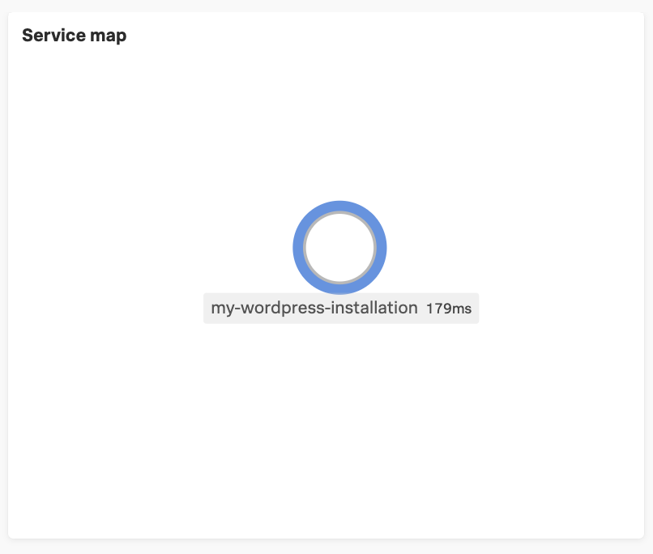

# Pre-reqs 

- Docker Compose
- Observability Cloud environment and [Ingest token](https://docs.splunk.com/observability/en/admin/authentication/authentication-tokens/org-tokens.html#manage-access-tokens)


## Running it

#### Edit the otel-collector-config.yaml file

L22 to 28 replace `"${SPLUNK_ACCESS_TOKEN}"` with the value of the token (e.g `"0000000000000"`)  
L22 to 28 replace `"${REALM}"` with the value of the token (e.g `"eu0"`)

#### In a shell, run:

```sh
docker-compose up --build --abort-on-container-exit
```

Then, go to http://localhost:8080 to set up Wordpress. Click around the finished site and you should see the traces in the Splunk Observablity Cloud APM tab (give it a couple of minutes for the dashboard to populate)

## Example trace

Here's an example of how a trace might look in Jaeger:






# OpenTelemetry Wordpress Instrumentation example

This example auto instruments the official [Wordpress docker image](https://hub.docker.com/_/wordpress) with OpenTelemetry. 
The official image is extended in [`autoinstrumented-wordpress.dockerfile`](./autoinstrumented-wordpress.dockerfile) to make it easy to get started 


### if you are curious you can see the step by step configuration performed by the dockerfile (you don't need to run this if you use docker-compose)

1. Install [OTel Wordpress instrumentation](../../../src/Instrumentation/Wordpress/) and
dependencies with composer in a build stage
2. Install [OTel PHP
extension](https://github.com/open-telemetry/opentelemetry-php-instrumentation) in the official
Wordpress image and configure it into the image's PHP installation (see
[`otel.php.ini`](./otel.php.ini)). This extension is required by the Wordpress instrumentation.
3. Copy the composer installed deps into the image. [`otel.php.ini`](./otel.php.ini)  
    

has a `auto_prepend_file=/var/www/otel/autoload.php` clause so that OTel is loaded into Wordpress sources at runtime.

In this example Wordpress send OTLP -> [OpenTelemetry
Collector](https://opentelemetry.io/docs/collector/) -> [Splunk Observability Cloud](https://docs.splunk.com/observability/en/get-started/get-started.html). 

